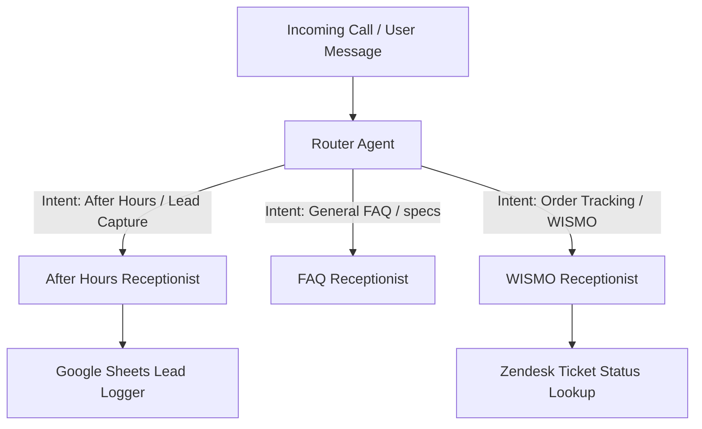

# Ariel Bath AI Receptionist SOP

This document defines the architecture, files, endpoints, schemas, and guidelines for the decoupled Ariel Bath AI Receptionist system. It excludes legacy swarm orchestration details to serve as a clean source of truth for the receptionist product.

---

## 🎯 System Architecture

The receptionist system handles incoming customer calls/messages via a Root Router, delegating to specialized agents based on user intent:

---

## 📁 File Registry

All files relevant to the Receptionist system are organized below:

### 1. Agent Directives (Prompts)

* **[After Hours Receptionist](file:///home/dnguyen029/antigravity-project/instructions/receptionist.txt)**: Prompt instructing lead-capture behavior.
* **[Router Agent](file:///home/dnguyen029/antigravity-project/instructions/router.txt)** *(Planned)*: Prompt for intent classification and subagent delegation.
* **[FAQ Receptionist](file:///home/dnguyen029/antigravity-project/instructions/faq_receptionist.txt)** *(Planned)*: Prompt for answering product/brand specifications.
* **[WISMO Receptionist](file:///home/dnguyen029/antigravity-project/instructions/wismo_receptionist.txt)** *(Planned)*: Prompt for PO lookup and ticket status check.

### 2. Integration Tools & Code

* **[Lead Logger (Sheets)](file:///home/dnguyen029/antigravity-project/tools/sheets.py)**: Python tool handling lead uploads to Google Sheets.
* **[Zendesk Integration](file:///home/dnguyen029/antigravity-project/tools/zendesk.py)**: Python tool handling Zendesk ticket checks.
* **[Execution Entrypoint](file:///home/dnguyen029/antigravity-project/main.py)**: The lightweight console/webhook entrypoint running the session loop.

---

## 📡 Live Production Deployment

* **Google Cloud Project**: `arielcsx`
* **Service Name**: `receptionist-prod` (hosted on Google Cloud Run in `us-west1`)
* **Authentication**: Google Default Identity (OIDC-based authentication)

### Webhook Endpoints

All webhook calls map to the Cloud Run service path:
* **Lead Logging (`/webhook/write-to-sheets` or `/log_lead`)**: Saves callback lead to Google Sheets and registers the ticket update in Zendesk.
* **Order Status Lookup (`/webhook/wismo-lookup` or `/wismo_lookup`)**:
  * **Input Payload**: `{"purchase_order": "PO-XXXXXX"}`
  * **Response Format**: `{"success": true, "found": true, "status": "shipped", "carrier": "FedEx", "tracking_number": "1Z...", "details": "..."}`
* **FAQ Grounding (`/webhook/faq-lookup` or `/faq_lookup`)**:
  * **Input Payload**: `{"query": "User question here"}`
  * **Response Format**: `{"success": true, "answer": "Response answer text...", "source": "..."}`

---

## 📋 Data Schema

All captured session parameters must conform to the following properties before logging:

| Parameter | Type | Required | Formatting / Validation |
| :--- | :--- | :--- | :--- |
| `name` | String | Yes | Captured customer name. |
| `phone_number` | String | Yes | Must be validated and stored in E.164 format (e.g. `+1XXXXXXXXXX`). |
| `email` | String | Yes | Captured email address. |
| `purchase_order` | String | No | PO number (only collected for WISMO / order flows). |
| `intent` | String | Yes | Intent classification (`Lead Capture`, `FAQ`, `WISMO`). |
| `urgency` | String | Yes | Urgency flag (`high` if user mentions "leak", "flood", "emergency", "broken", else `low`). |
| `sentiment` | String | Yes | Customer sentiment (`negative` if user sounds frustrated/angry, else `neutral`). |

---

## 🛡️ Core Conversational Rules

To ensure a high-quality call experience, all receptionist prompts must enforce these constraints:

1. **Strict Response Limit**: Maximum of **40 words** per response to maintain low latency.
2. **One Question at a Time**: Never ask the caller for multiple details in a single response.
3. **Mandatory Readback Verification**: You MUST read back both the phone number and the email address, confirming they are correct before calling logging tools.
4. **Single-Shot Logging**: Collect all required user details before invoking the Lead Logger tool.
5. **No AI Identity Disclosures**: Never mention being an AI or a bot; maintain the virtual assistant persona.
6. **Website Referral fallback**: Refer callers seeking deep technical specs or complex policies to `www.ArielBath.com`.
