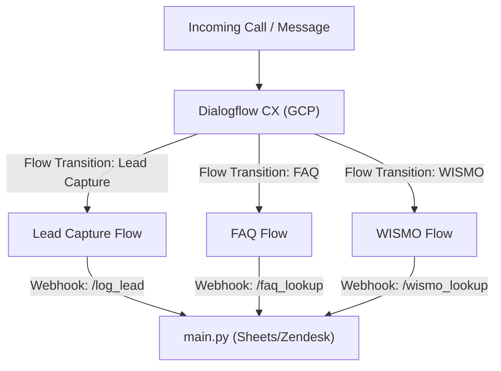

# Plan: Decoupled Dialogflow CX Webhook Architecture

This plan outlines the architecture for extending the Ariel Bath AI Receptionist using Dialogflow CX-native Flows and a unified Python webhook backend.

## Root Cause Analysis (RCA)
* **Symptom**: The original receptionist system was built directly in Dialogflow CX Studio and did not use a Python SDK or local agent framework in production.
* **Root Cause**: Voice/telephony capability requires Dialogflow CX's native telecom connectors, meaning conversation state must remain in Google Cloud while external actions (Google Sheets, Zendesk) run on the Python webhook.
* **Resolution**: Maintain Dialogflow CX as the conversation router and controller. Implement specialized webhook endpoints in the Python backend (`main.py`) to support WISMO lookup and FAQ grounding.

## Proposed Architecture

---

## Proposed Changes

### Webhook Engine

#### [MODIFY] [main.py](file:///home/dnguyen029/antigravity-project/main.py)
* Add `/webhook/wismo-lookup` endpoint:
  * Receives `purchase_order` from Dialogflow CX.
  * Queries Zendesk tickets using the existing `ZendeskClient`.
  * Returns the order status payload to Dialogflow CX.
* Add `/webhook/faq-lookup` endpoint:
  * Receives `query` from Dialogflow CX.
  * Optionally fetches context or returns fallbacks to refer callers to `www.ArielBath.com`.

### Prompt & Flow Templates (Reference Files)

#### [MODIFY] [RECEPTIONIST_SOP.md](file:///home/dnguyen029/antigravity-project/RECEPTIONIST_SOP.md)
* Document the webhook specifications for the new `/webhook/wismo-lookup` and `/webhook/faq-lookup` endpoints.

---

## Verification Plan

### Automated Tests
* Run syntax checks on `main.py` using the Python compiler.

### Manual Verification
* Start the local webhook server (`python main.py`) and simulate Dialogflow webhook requests using mock curl/http payloads to ensure Sheets, Zendesk, and FAQ responses are formatted correctly.
