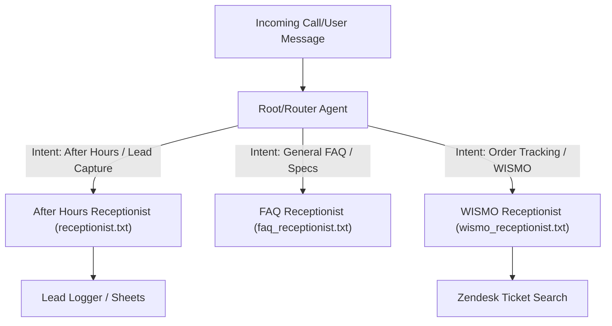

# Plan: Decoupled Receptionist Routing Architecture (Updated)

This plan outlines the design to extend the existing receptionist system by adding a Root/Router agent, a specialized FAQ agent, and a specialized WISMO (Where Is My Order) agent. The existing After-Hours receptionist ([receptionist.txt](file:///home/dnguyen029/antigravity-project/instructions/receptionist.txt)) remains unchanged as the lead capture target.

It also restores the architectural mappings (`DOMAIN_MAP.md` and `RIPPLE_MAP.md`) to the workspace root and documents key out-of-workspace file locations for easy agent reference.

## External File & SOP Locations (For Reference)

* **Dialogflow CX XML Prompt Template**: [receptionist_instructions.xml](file:///home/dnguyen029/.gemini/antigravity-cli/brain/8becfcae-0f83-48b8-9a52-b0544cffd449/.system_generated/worktrees/subagent-Code---Config-Mutator-builder-e6882f7c/src/prompts/receptionist_instructions.xml)
* **GCP Deploy Walkthrough & Webhook URL**: [walkthrough.md](file:///home/dnguyen029/ariel-cx-agent/walkthrough.md)
* **CX Agent Studio SOP**: [CX_AGENT_STUDIO_SOP.md](file:///home/dnguyen029/.gemini/antigravity-cli/brain/8becfcae-0f83-48b8-9a52-b0544cffd449/.system_generated/worktrees/subagent-Code---Config-Mutator-builder-e6882f7c/docs/reference/CX_AGENT_STUDIO_SOP.md)

---

## Proposed Architecture

## Proposed Changes

### Mapping Mappings

#### [NEW] [DOMAIN_MAP.md](file:///home/dnguyen029/antigravity-project/DOMAIN_MAP.md)
* **Description**: Cognitive and technical boundaries of the workspace, matching the historical [DOMAIN_MAP.md](file:///home/dnguyen029/.gemini/antigravity-cli/brain/8becfcae-0f83-48b8-9a52-b0544cffd449/.system_generated/worktrees/subagent-Code---Config-Mutator-builder-e6882f7c/mission/state/DOMAIN_MAP.md).

#### [NEW] [RIPPLE_MAP.md](file:///home/dnguyen029/antigravity-project/RIPPLE_MAP.md)
* **Description**: Architectural dependency and cascading update guide, matching the historical [RIPPLE_MAP.md](file:///home/dnguyen029/.gemini/antigravity-cli/brain/8becfcae-0f83-48b8-9a52-b0544cffd449/.system_generated/worktrees/subagent-Code---Config-Mutator-builder-e6882f7c/mission/state/RIPPLE_MAP.md).

#### [NEW] [RECEPTIONIST_SOP.md](file:///home/dnguyen029/antigravity-project/RECEPTIONIST_SOP.md)
* **Description**: Manifest and operating rules specifically for the Ariel Bath AI Receptionist routing system, excluding legacy swarm details.

### Core Agent Definitions

#### [NEW] [router.txt](file:///home/dnguyen029/antigravity-project/instructions/router.txt)
* **Role**: Root/Router Agent.
* **Responsibilities**: Analyze the user's initial query, categorize their intent (After Hours Lead Capture, FAQ, or WISMO Order Tracking), and delegate the session to the corresponding agent.

#### [NEW] [faq_receptionist.txt](file:///home/dnguyen029/antigravity-project/instructions/faq_receptionist.txt)
* **Role**: FAQ Receptionist.
* **Responsibilities**: Answer simple questions about product specs, brand info, or return policies based on www.ArielBath.com specs using Supermemory read context.

#### [NEW] [wismo_receptionist.txt](file:///home/dnguyen029/antigravity-project/instructions/wismo_receptionist.txt)
* **Role**: WISMO (Where Is My Order) Receptionist.
* **Responsibilities**: Ask for and capture the Purchase Order (PO) number, verify the name, and perform a lookup query to find the status.

### Code & API Updates

#### [MODIFY] [main.py](file:///home/dnguyen029/antigravity-project/main.py)
* Update `run_interactive_agent` to demonstrate the routing workflow:
  - User speaks to the Router Agent first.
  - Router Agent processes the input and prints a routing decision.
  - Subagent (FAQ, WISMO, or After Hours) is instantiated dynamically to respond.

---

## ❓ Open Questions (User Input Needed)

> [!IMPORTANT]
> **1. Order Lookup Tooling for WISMO**:
> Do we want to implement a real or mock lookup tool in `wismo_receptionist.txt` (e.g. searching sheets or zendesk tickets for order matching the PO number)? 

> [!WARNING]
> **2. FAQ Grounding Source**:
> Should the FAQ agent answer queries strictly from WWW.ArielBath.com via live web search/fetch, or should we query a pre-loaded FAQ knowledge set stored in Supermemory/Supabase?

---

## Verification Plan

### Automated Tests
* Run python compiler checks on `main.py`.

### Manual Verification
* Run `python main.py --interactive` to test the routing path (inputting "where is my order" routes to WISMO, "what is your return policy" routes to FAQ, and "take my info" routes to After Hours).
